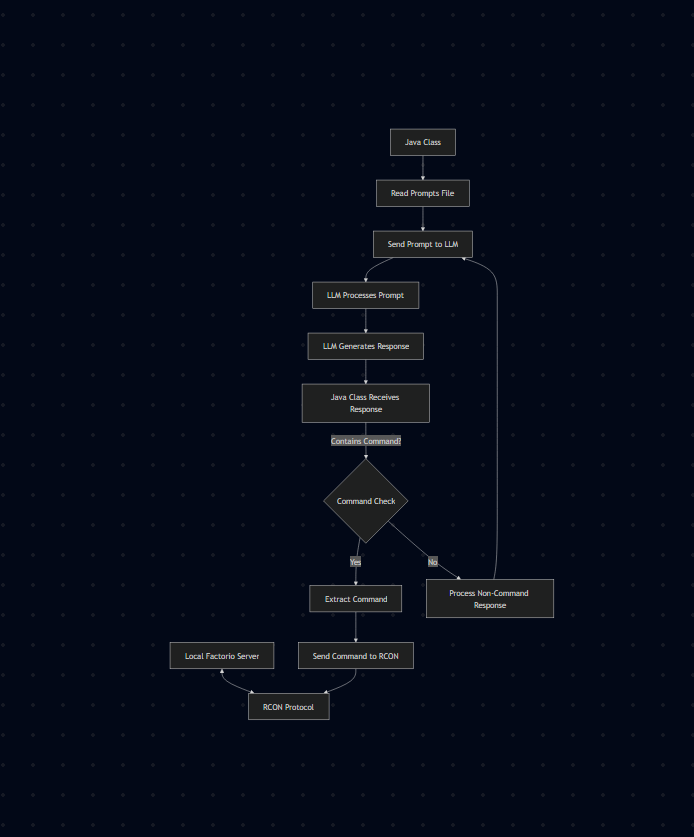

# LLM Agents for System Engineering in Factorio

A capstone project exploring how large language models (LLMs) can be guided to perform complex automation tasks in the sandbox game Factorio—using structured prompting, abstraction layers, and a real-time RCON control interface.

---

## Overview

Autonomous AI agents have the potential to revolutionize system engineering—from software and logistics to energy and manufacturing. Yet, traditional AI benchmarks fail to capture the planning, adaptability, and trade-offs inherent to complex, dynamic systems.

This project uses Factorio as an interactive simulation environment to evaluate LLM-driven agents in a way that reflects real-world engineering challenges. Agents are prompted through a custom DSL and guided by structured prompts to design, build, and scale fully functional factories in-game.

---

## About Me

My name is Josh, and I’m a Computer Science student with a focus on AI, systems programming, and software development. This capstone project allowed me to explore the intersection of language models, game automation, and real-time system design. I developed the project infrastructure—including a custom Java control server, in-game Lua mod, and a prompt testing framework—to evaluate how GPT-4 can be guided to perform complex tasks inside Factorio. Through this work, I gained experience in prompt engineering, API integration, and applying AI in a dynamic simulation environment. I'm passionate about building intelligent systems that bridge language and action, and this project has deepened my interest in the future of AI agents in real-world applications.

## System Architecture

1. **Prompt Input** — Prompts and initial game state are defined locally.
2. **LLM Interaction** — A Java program sends prompt content to the OpenAI API.
3. **Command Execution** — The response is parsed, validated, and sent to a local Factorio server via RCON.
4. **Game Feedback** — Factorio returns either a new game state or an error, which informs the next prompt cycle.
5. **Scoring** — Factory performance is scored manually or through custom mods.

---

## Demo Video

Click below to watch a live demo of the system in action:

[Watch the demo on Google Drive](https://drive.google.com/file/d/1rQ9mCtRjmY40LvZW1R_IWhIw-sIEvBvi/view?usp=sharing)

---

## Features

- Iterative LLM prompting with real-time environment feedback  
- Custom DSL and abstraction layer for command control  
- Overlap prevention and orientation logic via helper mod  
- Evaluation through item placement, orientation, and production success  

---

## Submit Feedback

If you'd like to leave feedback or share suggestions, fill out the form below:

---

## Author

**Josh Singontiko**  
Computer Science Capstone, CSU Channel Islands  
Spring 2025
